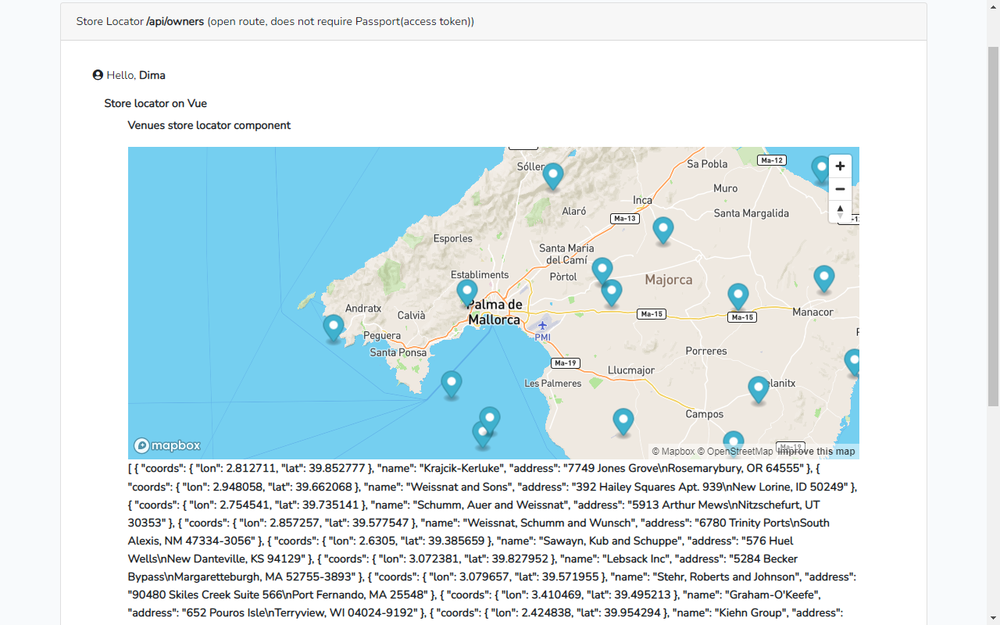

<!-- Status badges -->

> Php 7.2, mysql 5.6, db: 'laravel_2024_migration'

> A Sept 2024 test to run a new Laravel 6 app from the start with migrations, seeders, factories, model binding, hasMany, ManyToMany relations, Spatie Laravel permission + UI, PhpUnit tests, 
   Rest API resource/collection, Passport API authentication(routes protected by Passport requires that user must be authed via API Login controller (& get token)), 
   Github workflow CI/CD, Font Awesome 5 Icons, Vue JS (Vuex store, router), PHP_CodeSniffer, Psalm static analysis tool, Docker  etc.

### User login credentials 

 see => Database\Seeds\Subfolder\UserSeeder;   or see Factories\UserFactory 

 ----------------------------------------------------------------------------------------- 

### Content
- [1. Install Laravel 6 LTS, php 7.2](#1-install-laravel-6-lts-php-72)
- [2. Tables](#2-tables) 
- [3. New features](#3-new-features) 
- [4. Some notes](#4-some-notes)
- [5. Event/Listener](#5-eventlistener)
- [6. Testing (PhpUnit)](#6-testing-phpunit)
- [7. Passport](#7-passport)
- [8. Spatie Laravel Permission 5.3](#8-spatie-laravel-permission-53)
- [9. Github Workflow Action CI/CD](#9-github-workflow-action-cicd)
- [10. Spatie Laravel Permission GUI](#10-spatie-laravel-permission-gui)
- [11. PHP_CodeSniffer](#11-php_codesniffer)
- [12. Docker](#12-docker)
- [13. Psalm Static Analysis Tool](#13-psalm-static-analysis-tool)
- [14. Vue](#14-vue)
- [15. Notification (via database and email)](#15-notification-via-database-and-email)
- [16. Queue Job](#16-queue-job) 
- [17. Deploy CD](#17-deploy-cd)
- [18. SSH](#17-shh)

- [102. Known errors](#102-known-errors)
- [103. Screenshots](#103-screenshots)
- [104. Several commits to one](#104-several-commits-to-one)

 ----------------------------------------------------------------------------------------- 

## 1. Install Laravel 6 LTS, php 7.2

1.  Install => <code> composer create-project --prefer-dist laravel/laravel NAME_HERE "6.*"  </code> 

1.2. Install dependencies => <code > composer install </code> 

2. In browser can navigate to /public/  => the project should open 

3. In console CLI <code> cd NAME_HERE </code> , and <code>git init   git add.   git commit</code> if necessary 

4. Create DB and set in <code>.env (DB_DATABASE)</code> 

5. <code> php artisan migrate:fresh </code>  or take next step if need Auth.  If  on migration error "1071 Specified key was too long;", 
add to app/Providers/AppServiceProvider boot() <code>Schema::defaultStringLength(191); </code> 

5.1. Add Auth to project (cd to folder /NANE_HERE) => 
<ul> 
      <li>composer require laravel/ui "^1.0" --dev    OR  composer require laravel/ui  </li>
	  <li><code> php artisan ui vue --auth  </code>  (it will update routes in routes/web) </li>
	  <li><code> npm install && npm run dev </code> (adds  "Login and "register" to main page)(if this required in CLI as next step, do in Win cmd => npm install But most likely use  var2(tested) => npm install && npm run dev ) </li>
	  <li><code> php artisan migrate   </code>(to get users db out of the box) </li>
</ul>

5.2. If any custom migration added later => <code>php artisan migrate </code> 
     If have seeder  => <code>php artisan db:seed </code>     (we need seeders data in dev not testing, NB: now seeder also contains <code>php artisan migrate:fresh </code>, if not needed disable in seeder)        

	 

6. Now can add your route menu links and update route '/' instead of return view('welcome');  
If new route is not found => <code>php artisan route:clear</code>                              <code> composer dump-autoload </code>

6. Install Passport personal token (is needed to issue user tokens) => <code>php artisan passport:client --personal </code> 

NB: Laravel 6 does not supported: Enums(from php 8.1), Factory trait in model (Laravel 8), seeder ->sequence(), arrow functions (PHP 7.4), 
return type, i.e function x():string {}( PHP 7.4.0), seeding hasMany relation via ->has(), Pest test (PHP 8.2); AssertableJson ( for test)  
#If after install css crashes (not found app.css & app.js) -> npm intall -> npm run production

 ----------------------------------------------------------------------------------------- 

## 2. Tables
Owners, venues, equipment
Owner can has many Venues, each Venue has 1 Owner (One to Many Relationships: HasMany)
Venues can have many equipments, each equipment may be present in many Venues (Many to Many Relationships: BelongsToMany). Pivot table.

 ----------------------------------------------------------------------------------------- 

## 3. New features
<ul>
<li>migration, seeder, factory, Implicit Route Model Binding, local scopes, accessor, Api Resources/Collections, phpUnit test, event/listener (on owner create), Github workflow
policies, Spatie RBAC, middleware, Bootstrap Icons 5, console/Commands, Github Actions CI/CD, Docker
</li>
</ul>

 ----------------------------------------------------------------------------------------- 

## 4. Some notes
{{ $owner->first_name  }}  escaped html  
{!! $owner->first_name  !!}  unescaped thml
{{-- This comment will not be present in the rendered HTML --}}   comment
composer dump-autoload

git restore . is supported from git 2.23+ only, use git checkout . (or git checkout --compose.json)  ==== git clean -fd 

 ----------------------------------------------------------------------------------------- 

## 5. Event/Listener
Event/Listener => Models\Owner ($dispatchesEvents = [event/listener]), Event is bound to Listener in Providers\EventServiceProvider, app\Events\OwnerCreated & app\Listeners\SendOwnerCreatedNotification themselves.

 ----------------------------------------------------------------------------------------- 

## 6. Testing (PhpUnit)
OK (65 tests, 974 assertions) -> Tests: 76, Assertions: 1028   

1. create .env.testing and set 'DN_NAME_testing' there. Create a testing db itself, juxtapose to original DB in phpMyAdmin.i.e "laravel_2024_migration_testing"
2. Before testing, first time ever, do migrate tables to test database (dont seed as we run them in test itself), if have issues  <code> php artisan migrate:fresh --env=testing </code>
3. If tests are failing, clear cache in testing environment <code> php artisan config:cache --env=testing </code>
4. Run all tests    <code> php ./vendor/bin/phpunit </code>  OR  <code> php vendor/phpunit/phpunit/phpunit </code>  OR shortcut defined in composer.json <code>composer run-my-tests </code>
                        
  
Run one test Class => <code>  php ./vendor/bin/phpunit tests/Feature/Http/Api/Owners/OwnerControllerTest.php </code> 

  
  
Run one method from test Class =>   --filter {methodName} {pathToClass} => <code> php ./vendor/bin/phpunit --filter testCreatesNewOwnerWithVenues tests/Feature/Http/Controllers/Owner/OwnerControllerTest.php </code> 

4.1 If u run migration and it goes to wrong DB (prod or test) => php artisan config:cache
5. To see test errors =>  $this->withoutExceptionHandling(); //to see errors
6. Best Test example => Tests\Feature\Http\Api\Owners\OwnerControllerTest;

 ----------------------------------------------------------------------------------------- 

## 7. Passport

 https://www.twilio.com/en-us/blog/build-secure-api-php-laravel-passport 

#to be able to generate users access tokens (on login, register, etc)) u should firstly generate personal access token =>  <code> php artisan passport:client --personal  </code>

 for tests, you run this command programmatically in code, see example in Tests\Feature\Http\Api\Api_Auth\ApiRegisterTest;

Api unathenticated message is set in App\Exceptions\Handler

 Passport is enabled in routes/api with => <b> Route::middleware('auth:api')->group(.. </b>  , to access Passport protected route you send a header with Passport token in request ('Authorization' => 'Bearer '.$bearerToken,). Can see example in routes/console => find => 'test_api_route_protected_by_Passport'
Passport just checks if user is logged or not for API 

 ----------------------------------------------------------------------------------------- 

## 8. Spatie Laravel permission 5.3 
=> https://spatie.be/docs/laravel-permission/v6/installation-laravel
 <code> php artisan permission:cache-reset </code>
  a.)define policy by model, e.g => App\Policies\OwnerPolicy 
  b.) register policy in AuthServiceProvider 
  c.)use in  Controller => $this->authorize('view', Owner::class); //must have, Policy check (403 if fails) 
  d.) Spatie can be used both for http(sessions) and Api(token) requests (Api permission must be created with {'guard_name' => 'api'})  (No need for  additional set-up, like in "Laravel_Vue_Blog_V6_Passport" 
  
 Spatie checks if user has certain permission, if used together with Passport, Spatie works first, Passport second 

  
 
 ----------------------------------------------------------------------------------------- 

 
 
 
 
 
 
 
 
 
## 9. Github workflow action CI/CD
For example how to run PhpUnit tests, codesniffer, Pslam on github CI on every commit push, see  => .github/workflow/ci.yml

See CD deploy part example  => https://medium.com/@ikbenezer/automate-your-laravel-app-deployment-with-github-actions-ab7b2f7417f2  

 

 ----------------------------------------------------------------------------------------- 

 
 
 
 
 
 
 
 
 
 
## 10. Spatie Laravel permission GUI 
=> https://github.com/LaravelDaily/laravel-permission-editor

## Modifying package by fork 
=> fork, pull to local, edit, push. Add changes to composer.json => add "repositories" +  change package in "require" + composer update
https://phpreel.medium.com/how-to-use-a-forked-laravel-package-instead-of-the-original-90dd5b64068a
https://snippets.khromov.se/composer-use-your-own-fork-for-a-package/

Forked packages current status: forked package to my github -> edited -> changed composer.json  NOT FINISHED

https://github.com/account931/laravel-permission-editor-my-modified

Final result for Spatie Laravel permission GUI  : fork is not finished, used just for test, has copy-paste package https://github.com/LaravelDaily/laravel-permission-editor and modified it + re-wrote from TailWind Css to Bootstrap 4 

 ----------------------------------------------------------------------------------------- 

## 11. PHP_CodeSniffer
> config goes to => phpcs.xml.dist

 Run check (if Globally installed)   => <code> phpcs c:\Users\user\Downloads\OSPanel\domains\localhost\Laravel_2024_migration </code> 

 Run check (if installed in project) =>  <code> php vendor/bin/phpcs </code>   OR as defined in composer.json script <code> composer codesniffer-check </code> 

 Run fix   (if installed in project) =>  <code> php vendor/bin/phpcbf </code>

If "php vendor/bin/phpcs" finds an error and u want to disable it => run <code> php vendor/bin/phpcs -s </code> and see details like <b>  Missing file doc comment (PEAR.Commenting.FileComment.Missing) </b>
, after add it to /phpcs.xml.dist  => <exclude name="PEAR.Commenting.FileComment.Missing"/>

 ----------------------------------------------------------------------------------------- 

## 12. Docker 

<b> /docker/Dockerfile  </b>    => it is instruction for building container images    

<b> /docker-compose.yml </b>    => configuration for launching containers from images 

If u use Sail, you dont need Dockerfile, as Sail uses pre-build images

<code> docker-compose build </code>  => build images
<code> docker-compose up -d </code>  => start containers 

After containers are running, do usual stuff to launch Laravel 

To run inside container: 

<code>docker-compose exec my_larav_931_app composer install </code> => install dependencies in container, {my_larav_931_app} is php/apache container 

<code>docker-compose exec my_larav_931_app php artisan migrate </code> 

Laravel goes to    => http://localhost                  
PhpMyAdmin goes to => http://localhost:8080

<b> Using Docker on localhost: </b> 

 If you decide to use Docker on localhost instead of OpenServer, install Docker desktop & make sure to make changes to <b>.env </b> & <b>.env.testing </b> that correspond to values in <b>{docker-compose.yml}</b>, e.g <b>(DB_HOST=my_sql_db_container, DB_DATABASE=laravel_2024_migration, DB_USERNAME=user, DB_PASSWORD=password )</b>, or u can simply copy/paste from in <b> /env_donor_for_cicd </b>

 
When we test Docker in github CI we have to create <b>.env  </b> manually, as it is in .gitignore & .env is not in github.

 ----------------------------------------------------------------------------------------- 

## 13. Psalm static analysis tool
Run Psalm check          => <code> php vendor/bin/psalm --no-cache </code>  
Generate a baseline file => <code> php vendor/bin/psalm --set-baseline </code>  (psalm-baseline.xml)  
Config goes to           => <b> psalm.xml </b>

 ----------------------------------------------------------------------------------------- 

 ----------------------------------------------------------------------------------------- 

## 14. Vue
  Run {npm run watch} to watch changes
  
  Mapbox => npm install mapbox-gl

 ----------------------------------------------------------------------------------------- 

## 15. Notification (via database and email)
php artisan notifications:table  => create migration for table 'notifications'. Then run <code> php artisan migrate </b>

 public function via($notifiable){return ['database', 'mail']; 
 
 
## Notification (via email) (https://mailtrap.io/)
Register at https://mailtrap.io/ get and add credentials to .env =>  MAIL_HOST=sandbox.smtp.mailtrap.io, MAIL_USERNAME, etc   
Could see received email at => https://mailtrap.io/  (ac**@ukr.net, )

 ----------------------------------------------------------------------------------------- 

 ----------------------------------------------------------------------------------------- 

## 16. Queue Job
 Set up: 
     create db table 'jobs' => <code> php artisan queue:table </code>, run migration, add to  .env =>  QUEUE_CONNECTION=database  
     in .env => QUEUE_CONNECTION=database
 
 
Run job => ProcessPodcast::dispatch($podcast);  

 php artisan queue:work   

 ----------------------------------------------------------------------------------------- 

 ----------------------------------------------------------------------------------------- 

## 17. Deploy cd

php/apache  => render.com  (accou**1@ur*.n*t)  
SQL service => https://admin.alwaysdata.com/ (acc**1@ur*.n*t)  (m**1 + letter)   DB: dima_laravel_2024_migration   (use this)
               https://console.prisma.io/    (acc**1@ur*.n*t)  (m**1 + letter x2)    
               

 ----------------------------------------------------------------------------------------- 

## 18. SSH
Putty
 SSH host: ssh-di*****.alwaysdata.net  login:di*** 

 ----------------------------------------------------------------------------------------- 

## 102. Known errors
 Error 'There is no permission named `delete owners` for guard `web`.'  => $permissionDeleteOwner = Permission::firstOrCreate([ 'name' => 'delete owners', 'guard_name' => 'web' ]);   
 Error on PhpUnit tests, when new test returns several Users from DB, while there should be zero =>  using in tests & in /database/seeds this => DB::table('users') ->truncate();
 
 
 
 

 ----------------------------------------------------------------------------------------- 

## 103. Screenshots

> Api resource

> Password update

> Spatie Laravel permission UI (my custom)

> Forked (modified) Spatie Laravel permission UI ( from https://github.com/LaravelDaily/laravel-permission-editor) (to my https://github.com/LaravelDaily/laravel-permission-editor)

> Spatie Laravel permission UI package, re-written from TailWind Css to Bootstrap 4  

> Vue, Vuex store, router

> Venues store locator

 ----------------------------------------------------------------------------------------- 

## About Laravel

Laravel is a web application framework with expressive, elegant syntax. We believe development must be an enjoyable and creative experience to be truly fulfilling. Laravel takes the pain out of development by easing common tasks used in many web projects, such as:

- [Simple, fast routing engine](https://laravel.com/docs/routing).
- [Powerful dependency injection container](https://laravel.com/docs/container).
- Multiple back-ends for [session](https://laravel.com/docs/session) and [cache](https://laravel.com/docs/cache) storage.
- Expressive, intuitive [database ORM](https://laravel.com/docs/eloquent).
- Database agnostic [schema migrations](https://laravel.com/docs/migrations).
- [Robust background job processing](https://laravel.com/docs/queues).
- [Real-time event broadcasting](https://laravel.com/docs/broadcasting).

Laravel is accessible, powerful, and provides tools required for large, robust applications.

## Learning Laravel

Laravel has the most extensive and thorough [documentation](https://laravel.com/docs) and video tutorial library of all modern web application frameworks, making it a breeze to get started with the framework.

If you don't feel like reading, [Laracasts](https://laracasts.com) can help. Laracasts contains over 1500 video tutorials on a range of topics including Laravel, modern PHP, unit testing, and JavaScript. Boost your skills by digging into our comprehensive video library.

## Laravel Sponsors

We would like to extend our thanks to the following sponsors for funding Laravel development. If you are interested in becoming a sponsor, please visit the Laravel [Patreon page](https://patreon.com/taylorotwell).

- **[Vehikl](https://vehikl.com/)**
- **[Tighten Co.](https://tighten.co)**
- **[Kirschbaum Development Group](https://kirschbaumdevelopment.com)**
- **[64 Robots](https://64robots.com)**
- **[Cubet Techno Labs](https://cubettech.com)**
- **[Cyber-Duck](https://cyber-duck.co.uk)**
- **[British Software Development](https://www.britishsoftware.co)**
- **[Webdock, Fast VPS Hosting](https://www.webdock.io/en)**
- **[DevSquad](https://devsquad.com)**
- [UserInsights](https://userinsights.com)
- [Fragrantica](https://www.fragrantica.com)
- [SOFTonSOFA](https://softonsofa.com/)
- [User10](https://user10.com)
- [Soumettre.fr](https://soumettre.fr/)
- [CodeBrisk](https://codebrisk.com)
- [1Forge](https://1forge.com)
- [TECPRESSO](https://tecpresso.co.jp/)
- [Runtime Converter](http://runtimeconverter.com/)
- [WebL'Agence](https://weblagence.com/)
- [Invoice Ninja](https://www.invoiceninja.com)
- [iMi digital](https://www.imi-digital.de/)
- [Earthlink](https://www.earthlink.ro/)
- [Steadfast Collective](https://steadfastcollective.com/)
- [We Are The Robots Inc.](https://watr.mx/)
- [Understand.io](https://www.understand.io/)
- [Abdel Elrafa](https://abdelelrafa.com)
- [Hyper Host](https://hyper.host)
- [Appoly](https://www.appoly.co.uk)
- [OP.GG](https://op.gg)

## Contributing

Thank you for considering contributing to the Laravel framework! The contribution guide can be found in the [Laravel documentation](https://laravel.com/docs/contributions).

## Code of Conduct

In order to ensure that the Laravel community is welcoming to all, please review and abide by the [Code of Conduct](https://laravel.com/docs/contributions#code-of-conduct).

## Security Vulnerabilities

If you discover a security vulnerability within Laravel, please send an e-mail to Taylor Otwell via [taylor@laravel.com](mailto:taylor@laravel.com). All security vulnerabilities will be promptly addressed.

## License

The Laravel framework is open-sourced software licensed under the [MIT license](https://opensource.org/licenses/MIT).

 ----------------------------------------------------------------------------------------- 

## 104. Several commits to one 
(for example 2 last)
<code>git reset --soft HEAD~2 </code>
<code>git commit -m "new commit message" <code>
<code>git push -f <code>