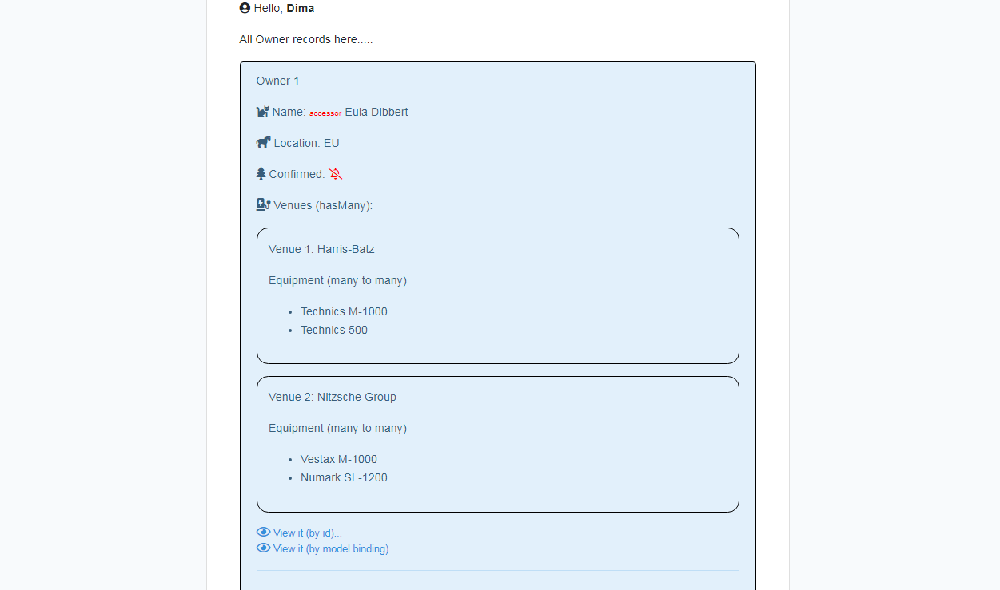

> A Sept 2024 test to run a new Laravel 6 app from the start with migrations, seeders, factories, model binding, hasMany, ManyToMany relatios, etc.

## Install Laravel 6 LTS, php 7.2

1. Install => <code> composer create-project --prefer-dist laravel/laravel NAME_HERE "6.*"  </code> 

2. In browser can navigate to /public/  => the project should open 

3. In console CLI <code> cd NAME_HERE </code> , and <code>git init   git add.   git commit</code> if necessary 

4. Create DB and set in <code>.env (DB_DATABASE)</code> 

5. <code>php artisan migrate </code>  or take next step if need Auth.  If  on migration error "1071 Specified key was too long;", 
add to app/Providers/AppServiceProvider boot() <code>Schema::defaultStringLength(191); </code> 

5.1. Add Auth to project (cd to folder /NANE_HERE) => 
<ul> 
      <li>composer require laravel/ui "^1.0" --dev    OR  composer require laravel/ui  </li>
	  <li><code> php artisan ui vue --auth  </code>  (it will update routes in routes/web) </li>
	  <li><code> npm install && npm run dev </code> (adds  "Login and "register" to main page)(if this required in CLI as next step, do in Win cmd => npm install But most likely use  var2(tested) => npm install && npm run dev ) </li>
	  <li><code> php artisan migrate   </code>(to get users db out of the box) </li>
</ul>

5.2. If any custom migration added later => <code>php artisan migrate </code> 
     If have seeder                      => <code>php artisan db:seed </code> 

	 

6. Now can add your route menu links and update route '/' instead of return view('welcome');  
If new route is not found => <code>php artisan route:clear</code>  
                             <code> composer dump-autoload </code>

NB: Laravel 6 does not supported: Enums(from php 8.1), Factory trait in model (Laravel 8), seeder ->sequence(), arrow functions (PHP 7.4), 
type hinting( PHP 7.4.0), seeding hasMany relation via ->has()   
#If after install css crashes (not found app.css & app.js) -> npm intall -> npm run production

## Tables
Owners, venues, equipment
Owner can has many Venues, each Venue has 1 Owner (One to Many Relationships: HasMany)
Venues can have many equipments, each equipment may be present in many Venues (Many to Many Relationships: BelongsToMany). Pivot table.

## New features
<ul>
<li>Implicit Route Model Binding, local scopes, accessor</li>
</ul>

## Some notes
{{ $owner->first_name  }}  escaped html  
{!! $owner->first_name  !!}  unescaped thml

## Screenshots

> Api resource

> Password update

## About Laravel

Laravel is a web application framework with expressive, elegant syntax. We believe development must be an enjoyable and creative experience to be truly fulfilling. Laravel takes the pain out of development by easing common tasks used in many web projects, such as:

- [Simple, fast routing engine](https://laravel.com/docs/routing).
- [Powerful dependency injection container](https://laravel.com/docs/container).
- Multiple back-ends for [session](https://laravel.com/docs/session) and [cache](https://laravel.com/docs/cache) storage.
- Expressive, intuitive [database ORM](https://laravel.com/docs/eloquent).
- Database agnostic [schema migrations](https://laravel.com/docs/migrations).
- [Robust background job processing](https://laravel.com/docs/queues).
- [Real-time event broadcasting](https://laravel.com/docs/broadcasting).

Laravel is accessible, powerful, and provides tools required for large, robust applications.

## Learning Laravel

Laravel has the most extensive and thorough [documentation](https://laravel.com/docs) and video tutorial library of all modern web application frameworks, making it a breeze to get started with the framework.

If you don't feel like reading, [Laracasts](https://laracasts.com) can help. Laracasts contains over 1500 video tutorials on a range of topics including Laravel, modern PHP, unit testing, and JavaScript. Boost your skills by digging into our comprehensive video library.

## Laravel Sponsors

We would like to extend our thanks to the following sponsors for funding Laravel development. If you are interested in becoming a sponsor, please visit the Laravel [Patreon page](https://patreon.com/taylorotwell).

- **[Vehikl](https://vehikl.com/)**
- **[Tighten Co.](https://tighten.co)**
- **[Kirschbaum Development Group](https://kirschbaumdevelopment.com)**
- **[64 Robots](https://64robots.com)**
- **[Cubet Techno Labs](https://cubettech.com)**
- **[Cyber-Duck](https://cyber-duck.co.uk)**
- **[British Software Development](https://www.britishsoftware.co)**
- **[Webdock, Fast VPS Hosting](https://www.webdock.io/en)**
- **[DevSquad](https://devsquad.com)**
- [UserInsights](https://userinsights.com)
- [Fragrantica](https://www.fragrantica.com)
- [SOFTonSOFA](https://softonsofa.com/)
- [User10](https://user10.com)
- [Soumettre.fr](https://soumettre.fr/)
- [CodeBrisk](https://codebrisk.com)
- [1Forge](https://1forge.com)
- [TECPRESSO](https://tecpresso.co.jp/)
- [Runtime Converter](http://runtimeconverter.com/)
- [WebL'Agence](https://weblagence.com/)
- [Invoice Ninja](https://www.invoiceninja.com)
- [iMi digital](https://www.imi-digital.de/)
- [Earthlink](https://www.earthlink.ro/)
- [Steadfast Collective](https://steadfastcollective.com/)
- [We Are The Robots Inc.](https://watr.mx/)
- [Understand.io](https://www.understand.io/)
- [Abdel Elrafa](https://abdelelrafa.com)
- [Hyper Host](https://hyper.host)
- [Appoly](https://www.appoly.co.uk)
- [OP.GG](https://op.gg)

## Contributing

Thank you for considering contributing to the Laravel framework! The contribution guide can be found in the [Laravel documentation](https://laravel.com/docs/contributions).

## Code of Conduct

In order to ensure that the Laravel community is welcoming to all, please review and abide by the [Code of Conduct](https://laravel.com/docs/contributions#code-of-conduct).

## Security Vulnerabilities

If you discover a security vulnerability within Laravel, please send an e-mail to Taylor Otwell via [taylor@laravel.com](mailto:taylor@laravel.com). All security vulnerabilities will be promptly addressed.

## License

The Laravel framework is open-sourced software licensed under the [MIT license](https://opensource.org/licenses/MIT).
